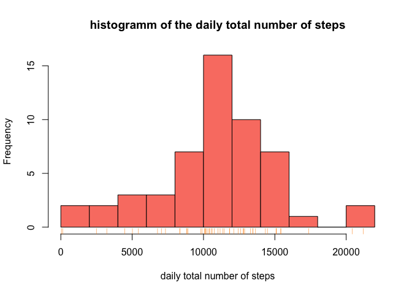
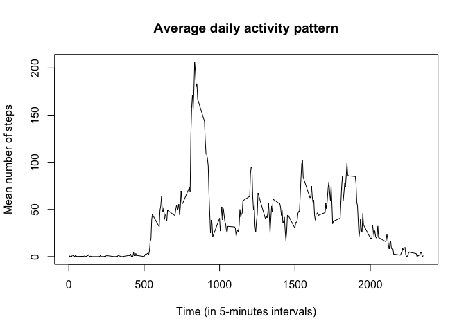
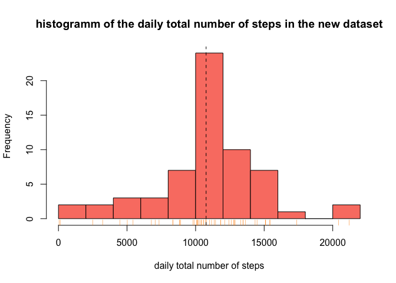

# Daily activity - report

## Loading and pre-processing the data  

1. First, set "Daily activity" as your working directory.  


2. We are now ready to load the data and visualize it :  


```r
if (!file.exists("activity.csv")) {
        unzip("activity.zip")
        }
table <- read.csv("activity.csv", header=TRUE, na.strings="NA")
str(table)
```

```
## 'data.frame':	17568 obs. of  3 variables:
##  $ steps   : int  NA NA NA NA NA NA NA NA NA NA ...
##  $ date    : Factor w/ 61 levels "2012-10-01","2012-10-02",..: 1 1 1 1 1 1 1 1 1 1 ...
##  $ interval: int  0 5 10 15 20 25 30 35 40 45 ...
```


3. Let's load the *dplyr* package and change some data type :


```r
library(dplyr)
table <- mutate(table, date=as.Date(date))
```


## What is the mean total number of steps taken per day?


1. First, let's calculate the daily total number of steps. 
We will not consider NA values (e.g days with only NA values will be filtered), 
since no measurement is available.


```r
library(knitr)
daily <- na.omit(group_by(table, date))
daily_sum <- summarize(daily, steps=sum(steps))
#kable(head(daily_sum, n=4))
head(daily_sum, n=4)
```

```
## Source: local data frame [4 x 2]
## 
##         date steps
##       (date) (int)
## 1 2012-10-02   126
## 2 2012-10-03 11352
## 3 2012-10-04 12116
## 4 2012-10-05 13294
```


2. Let's create an histogramm of the daily total number of steps :


```r
hist(daily_sum$steps, breaks=10, col='salmon', 
     main='histogramm of the daily total number of steps',
     xlab='daily total number of steps')
rug(daily_sum$steps, col='DarkOrange')
```

 


3. We can now evaluate the mean and median values :


```r
options(scipen = 5, digits = 2) 
## Set the threshold for scientific notation (10e5) 
## and the number of digits to keep after the comma
mean_value <- mean(daily_sum$steps)
median_value <- median(daily_sum$steps)
```

The mean total number of steps taken per day is **10766.19**.  
The median of the daily total number of steps is **10765**.  
Both values are almost equal, meaning that the distribution is rather symmetrical.


## What is the average daily activity pattern?


1. First, let's calculate the mean number of steps for each time interval of the day. 
We will not consider NA values (e.g days with only NA values will be filtered), 
since no measurement is available.


```r
interv <- na.omit(group_by(table, interval))
interv_mean <- summarize(interv, steps=mean(steps))
#kable(head(interv_mean, n=4))
head(interv_mean, n=4)
```

```
## Source: local data frame [4 x 2]
## 
##   interval steps
##      (int) (dbl)
## 1        0  1.72
## 2        5  0.34
## 3       10  0.13
## 4       15  0.15
```


2. Now we can plot a time series to better vizualize the evolution across the day :


```r
plot(interv_mean$interval, interv_mean$steps,
     main="Average daily activity pattern",
     ylab="Mean number of steps", xlab="Time (in 5-minutes intervals)", type="l")
```

 


3. Finally, let's calculate the 5-minutes interval with the highest average number of steps :


```r
index <- which.max(interv_mean$steps)
timeofmax <- interv_mean$interval[index]
```

The identifier for the 5-minute interval in which the highest average number of steps was measured is : **835 minutes**.


## Imputing missing values


We want to  take into account the missing values now, to avoid introducing a bias in our study.


1. Total number of missing values (rows containing NAs) in the dataset :


```r
NA_number <- sum(is.na(table))
```

There are **2304** rows with NAs in the dataset.


2. Let's create a vector of missing data by using the average daily activity pattern : each NA becomes the mean number of steps for the corresponding time interval.


```r
missing_steps <- table$steps
for (i in 1:length(missing_steps)){
        if (is.na(table$steps[i])){
                index <- which(interv_mean$interval==table$interval[i])
                missing_steps[i] <- interv_mean$steps[index]
        }
}
```


3. We will now create a new table which is a copy of the original table, but the original steps variable containing NAs is replaced by the "missing_steps" vector we just created, where every NA becomes the mean steps number for the corresponding interval.


```r
new_table <- mutate(table, steps=missing_steps)
#kable(head(table, n=4))
head(new_table, n=4)
```

```
##   steps       date interval
## 1  1.72 2012-10-01        0
## 2  0.34 2012-10-01        5
## 3  0.13 2012-10-01       10
## 4  0.15 2012-10-01       15
```


4. Now let's make an histogram of the total number of steps taken each day, and calculate the mean and median total number of steps taken per day :


```r
new_daily <- group_by(new_table, date)
new_daily_sum <- summarize(new_daily, steps=sum(steps))

hist(new_daily_sum$steps, breaks=10, col='salmon', 
     main='histogramm of the daily total number of steps in the new dataset',
     xlab='daily total number of steps')
rug(new_daily_sum$steps, col='DarkOrange')

new_mean_value <- mean(daily_sum$steps)
new_median_value <- median(daily_sum$steps)
abline(v=new_mean_value, col='black', lty=2)
```

 

The mean total number of steps taken per day is **10766.19**.  
The median of the daily total number of steps is **10765**.  
The values are the same than precedently (see the first part of the project). Since we filled the missing values with the mean value calculated for the non-missing data, the daily total number of steps for the days with no data available simply became the average total number of steps. We can see in the new histogram that the mean value occurs with a highest frequency.


## Are there differences in activity patterns between weekdays and weekends?


In this part we will use the new dataset, with filled-in missing values. 


1. Firstly, we want to add one column containing the week days corresponding to the dates given in the second column. We also want to add a new factor variable with two levels ("weekday" and "weekend") indicating whether a given date is a weekday or weekend (Saturday - Sunday) day.


```r
new_table <- mutate(new_table, day=weekdays(date), day_factor=as.factor(weekdays(date)))
levels(new_table$day_factor) <- c("weekday", "weekday", "weekend", 
                               "weekend", "weekday", "weekday", "weekday")
```


2. Let's plot time series for weekday and weekend days to vizualize the evolution (across one day) of the mean number of steps for each time interval :


```r
new_interv <- group_by(new_table, interval, day_factor)
new_interv_mean <- summarize(new_interv, steps=mean(steps))

library(lattice)
xyplot(new_interv_mean$steps ~ new_interv_mean$interval | new_interv_mean$day_factor, 
       type = "l", xlab="Interval", ylab="Number of steps", layout=c(1,2))
```

 


